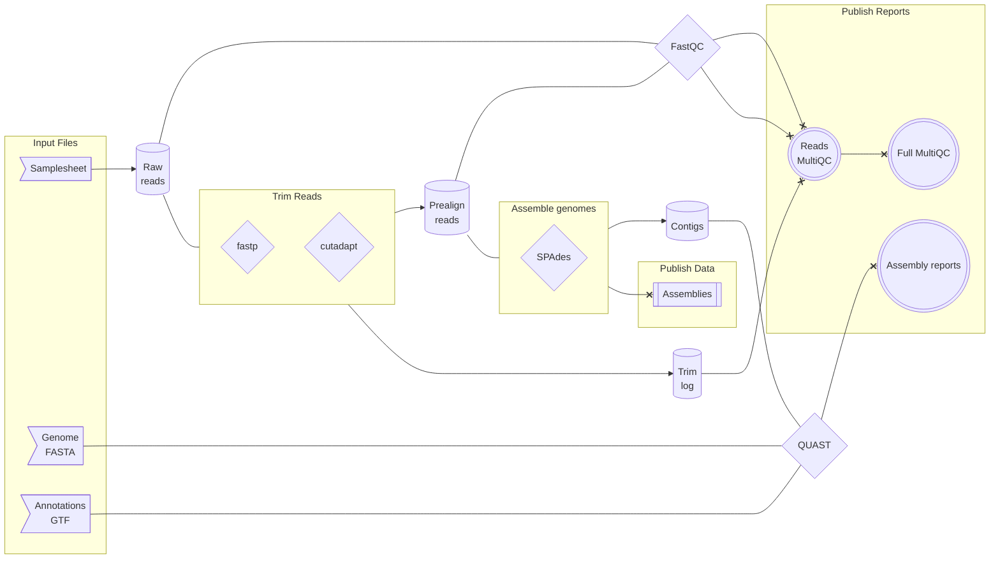

# `utia-gc/assemble-isolate-genomes`

[](https://code.askimed.com/nf-test)
[](https://lifecycle.r-lib.org/articles/stages.html#experimental)
[](https://sylabs.io/docs/)

:book:[Full documentation on GitHub Pages]:book:

## Introduction

`utia-gc/assemble-isolate-genomes` is a [Nextflow](https://www.nextflow.io/) pipeline for base NGS analysis.
While `utia-gc/assemble-isolate-genomes` can be run on any platform supported by Nextflow, it is developed for use in HPC environments and specifically [ISAAC Next Generation] at the University of Tennessee, Knoxville.

### Pipeline overview



## Quick start

### Prerequisites

1. Any POSIX compatible system (e.g. Linux, OS X, etc) with internet access

   - Run on Windows with [Windows Subsystem for Linux (WSL)](https://docs.microsoft.com/en-us/windows/wsl/). WSL2 highly recommended.

2. [Nextflow](https://www.nextflow.io/) version >= 21.04

   - See [Nextflow Get started](https://www.nextflow.io/docs/latest/getstarted.html#) for prerequisites and instructions on installing and updating Nextflow.

3. [Singularity](https://sylabs.io)

### Get or update `utia-gc/assemble-isolate-genomes`

1. Download or update `utia-gc/assemble-isolate-genomes`:

    ```bash
    nextflow pull utia-gc/assemble-isolate-genomes
    ```

2. Show project info:

    ```bash
    nextflow info utia-gc/assemble-isolate-genomes
    ```

### Test `utia-gc/assemble-isolate-genomes`

1. Check that `utia-gc/assemble-isolate-genomes` works on your system:

   - `-profile nf_test` uses preconfigured test parameters to run `utia-gc/assemble-isolate-genomes` in full on a small test dataset stored in a remote GitHub repository.
   - Because these test files are stored in a remote repository, internet access is required to run the test.
   - For more information, see the `profiles` section of the [nextflow config file](nextflow.config).

   ```bash
   nextflow run utia-gc/assemble-isolate-genomes \
      -revision main \
      -profile nf_test
   ```

> [!IMPORTANT]
> In accordance with best practices for reproducible analysis, always use the `-revision` option in `nextflow run` to specify a tagged and/or released version of the pipeline.

### Run `utia-gc/assemble-isolate-genomes`

TODO

[Full documentation on GitHub Pages]: https://utia-gc.github.io/assemble-isolate-genomes/
